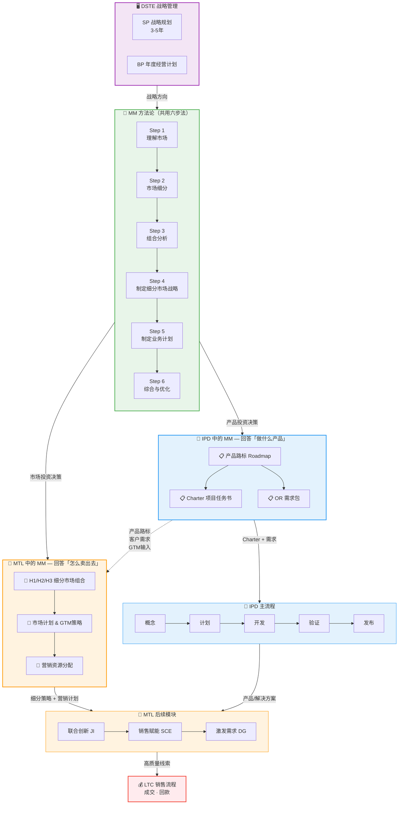
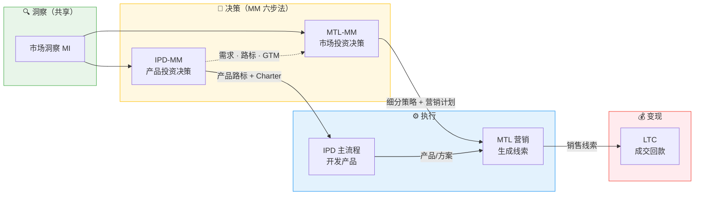
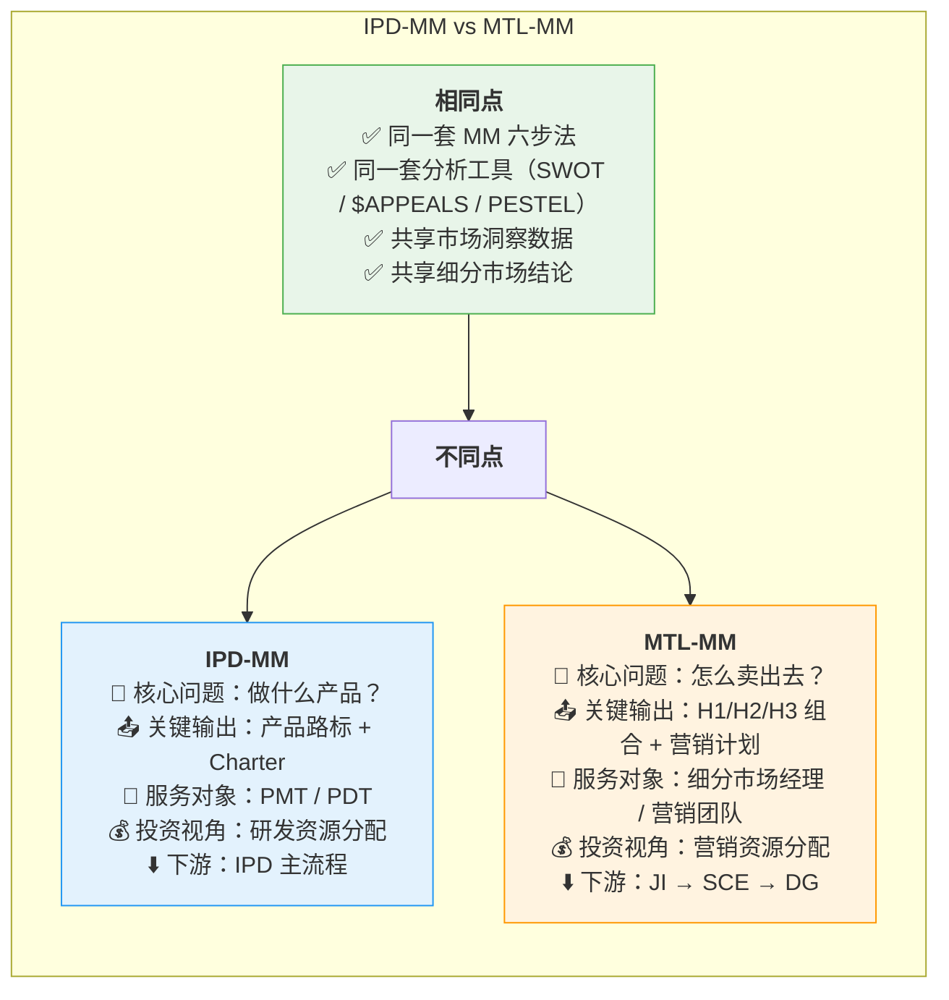

# IPD的MM与MTL的MM关系图

## 总览：同一方法论，两个应用场景

---

## 端到端信息流转

---

## 对比表：两个场景的差异

---

## 一句话总结

> **IPD 的 MM 和 MTL 的 MM 是同一套方法论的两个应用**——IPD 用它决定"做什么产品"（研发侧），MTL 用它决定"怎么卖出去"（营销侧）。两者共享洞察和分析，IPD-MM 的输出是 MTL-MM 的关键输入。

---

_关联：[[IPD流程架构]] · [[MTL流程架构]] · [[IPD解读——市场管理（MM）方法论]] · [[MM市场管理流程概述]]_
